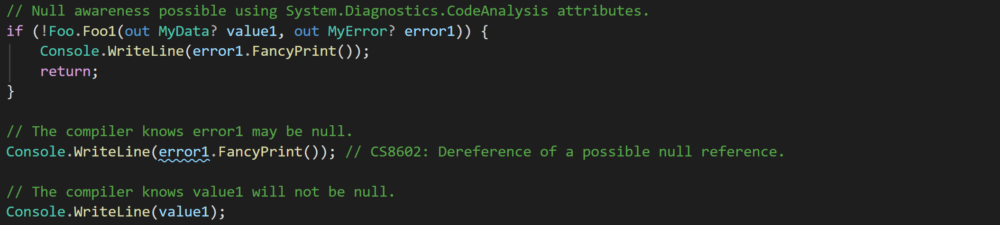
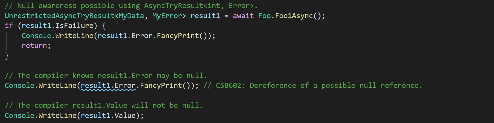
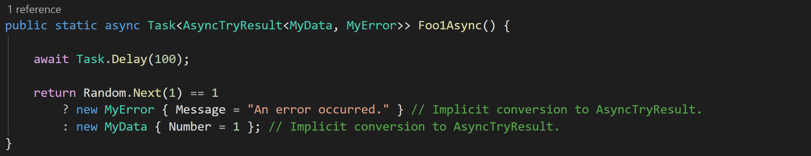
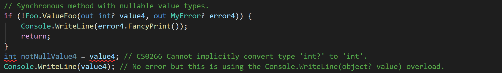
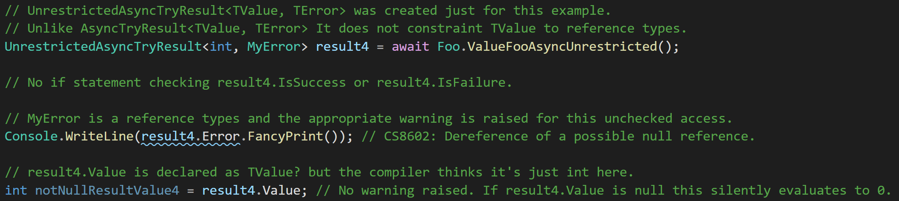
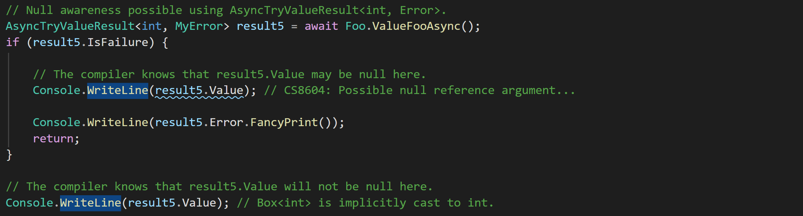
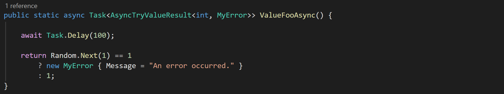
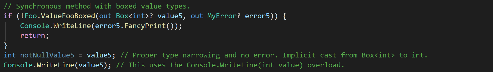

# AsyncTryResult
A lightweight library providing out-variable-like functionality for async methods in C#.

## Basdic Example

Using the `[NotNullWhen]` attribute from `System.Diagnostics.CodeAnalysis` it is possible to inform the compiler that out parameters of a method you define will not be null depending on the return value. This is shown below.

Unfortunately, this is not possible for asynchronous methods because out parameters on async methods are not supported in C#. This library provides the `AsyncTryResult<TValue, TError>` (and several other similar ones) to fill this gap. Using these types you can write concise error handling code that is null-checked by the compiler.

Defining a function that uses `AsyncTryResult<TValue, TError>` is shown below. The implicit conversions from `TValue` and `TError` to the result types make their use mostly transparent to the developer.

## But Why *This* Result Type
A vast host of result type libraries are available in C#.

## Value Type Weirdness

*I am not a CLR expert. I believe the following to be a reasonable explanation but feel free to correct me.*

C# handles nullable value types differently than nullable reference types. Instead of tracking the nullability of reference types with compile time static analysis, nullable value types are syntactic sugar for `System.Nullable<T>`. The unfortunate side effect of this is that the `System.Diagnostics.CodeAnalysis` attributes – such as `[NotNullWhen]`, which can be used to narrow nullable reference types at compile time, do not work with nullable value types. Some problematic examples caused by this are shown below.

In the first example, `ValueFoo()` indicates that the out parameter, `value4`, is not null when the the function returns true using a `[NotNullWhen(true)]` attribute. If `value4` were a value type the compiler would know that `value4` was not null after the close of the if-block. For value types this is evidently not the case.

The second example is more dangerous and is the reason why `TValue` and `TError` are constrainted to reference types.

In this example, `ValueFooAsyn2()` returns a `UnrestrictedAsyncTryResult<int, MyError>` – a type created specifically for this example. This object has properties `TError? Error`, `TValue? Value`, `bool IsSuccess`, and `bool IsFailure`. The latter two properties are decorated with `[MemberNotNullWhen] attributes` indicating that the `Value` parameter is not null when `IsSuccess` is true, et cetera.

As shown in the code below, this works for the property `Error`, which is a reference type, and unchecked access to `Error` results in a compile time warning. In contrast, unchecked access to `Value`, which is a value type, does not yield any warning. More concerningly, if `result4.Value` is accessed while it is null it silently fails and evaluates to 0. No `NullRefernceException` is raised.

### Value Type Solution

To manage this difference, this library provides the `AsyncTryValueResult<TValue, TError>` and `AsyncTryValueResult<TValue>` types. These types restrict `Tvalue` to value types and wrap the value in a simple `Box<T>` reference type. The `Box<T>` definces implicit operators for converting to and from type `T` to allow for easy conversion.

The usage of `AsyncTryValueResult<TValue, TError>` in a method definition is shown below. Again, the implicit casts from `TValue` and `TError` to `AsyncTryValueResult<TValue, TError>` make its usage mostly transparent to the developer.

It is also possible wrap the out parameters of a synchronous method with the `Box<T>` type recieve proper null type narrowing.

No alternative type is provided to support value types for `TError`. This choice was made because it is expected that most users will use strings or custom error types as `TError`, both of which are reference types. In addition, doing so would require three more permutations of the result types which felt clunky.

*It's a bit clunky that I need to have separate types for reference and value types, but if Microsoft can have `Task<>` and `ValueTask<>` then I can do this. I could have boxed everything and just had one set of result types but I am afraid that dealing with `Box<T>` will be awkward in some situations; implicit casts can only take you so far in my experience. It would be ideal of .Net treated nullable reference and value types the same, but I assume doing so would require substantial breaking changes. Perhaps its better we don't have ".Net Core 2: Electric Boogaloo".*