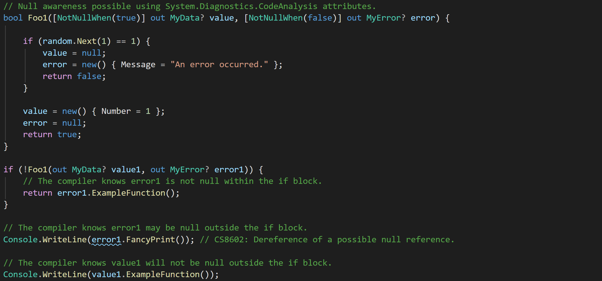
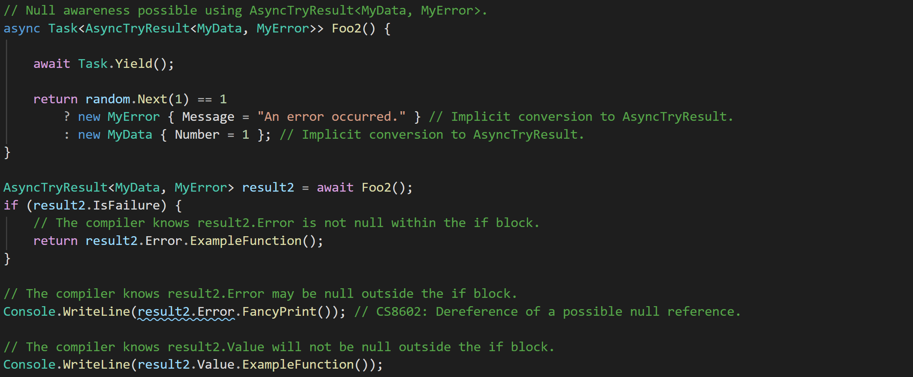
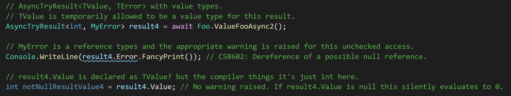
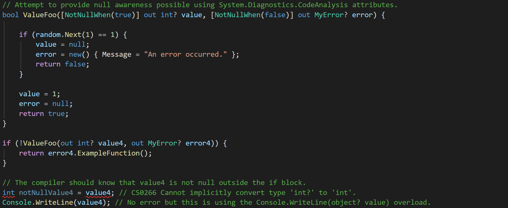
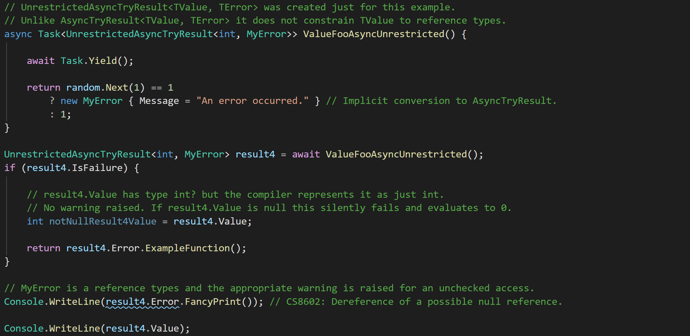
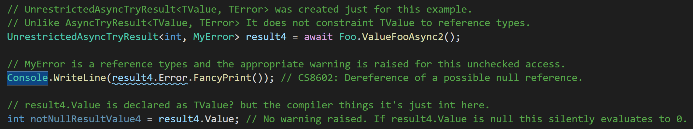
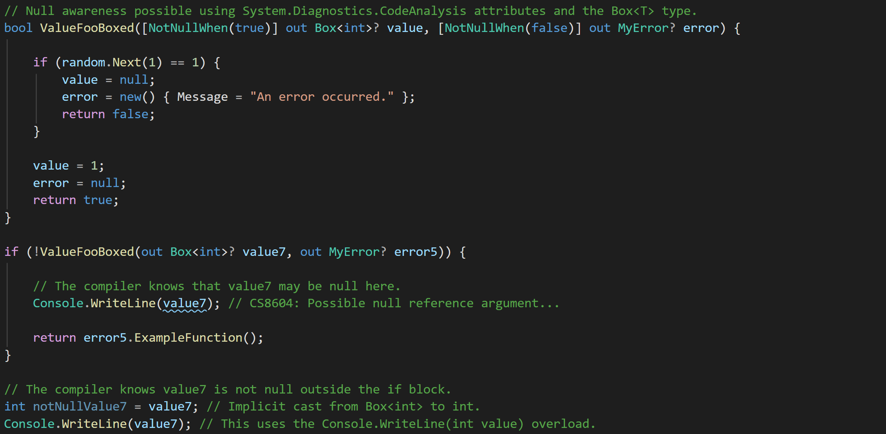

# AsyncTryResult
A lightweight library providing out-variable-like functionality for async methods in C#.

## Built-in Functionality and Example

Using the `[NotNullWhen]` attribute from `System.Diagnostics.CodeAnalysis` it is possible to inform the compiler that the out parameters of a method will not be null depending on the return value. This is shown below.

Unfortunately, this is not possible for asynchronous methods because out parameters on async methods are not supported in C#. This library provides the `AsyncTryResult<TValue, TError>` and `AsyncTryValueResult<TValue, TError>` to fill this gap. Using these types you can write concise error handling code that is null-checked by the compiler.

## But Why *This* Result Type
A vast host of result type libraries are available in C#, each of which has a slightly different primary focus and feature set. Some focus on ASP.NET compatibility and out of the box conversions to HTTP results, some add discriminated-union-like functionality, and some provide more functional features and allow the fluent chaining of many operations.

AsyncTaskResult is optimized for the following:
- Very small and simple to understand (73 LOC excluding comments and whitespace).
- Does not provide opinionated errors. You are required to bring your own.
- Error handling that takes advantage of the compiler's null-checking.
- Extremely concise error handling when you only care if an operation was a success or failure.

## Value Type Weirdness

*I am not a CLR expert. I believe the following to be a reasonable explanation, but feel free to correct me.*

C# handles nullable value types differently than nullable reference types. Instead of tracking the nullability of reference types with compile time static analysis, nullable value types are syntactic sugar for `System.Nullable<T>`. The unfortunate side effect of this is that the `System.Diagnostics.CodeAnalysis` attributes – such as `[NotNullWhen]`, which can be used to narrow nullable reference types at compile time, do not work with nullable value types. Some problematic examples caused by this are shown below.

In the first example, `ValueFoo()` uses a `[NotNullWhen(true)]` attribute to indicate that the out parameter, `value`, is not null when the function returns true. If this worked with value types as it does with reference types, the compiler would know that `value4` was not null after the close of the if-block. However, as can be seen in the example below, this is evidently not the case.

The second example is more dangerous and is the reason why `TValue` and `TError` are constrained to reference types in `AsyncTryResult<int, MyError>`.

In this example, `ValueFooAsyncUnrestricted()` returns a `UnrestrictedAsyncTryResult<int, MyError>` – a type created specifically for this example. This object has properties `TError? Error`, `TValue? Value`, `bool IsSuccess`, and `bool IsFailure`. The latter two properties are decorated with `[MemberNotNullWhen] attributes` indicating that the `Value` property is not null when `IsSuccess` is true, et cetera.

As shown in the code below, this works for the property `Error`, which is a reference type, and unchecked access to `Error` results in a compile time warning. In contrast, unchecked access to `Value`, which is a value type, does not yield any warning. Even more concerningly, if `result5.Value` is accessed while it is null, it silently fails and evaluates to 0. No `NullReferenceException` is raised.

### Value Type Solution

To manage this difference, this library provides the `AsyncTryValueResult<TValue, TError>` type. This type restrict `TValue` to value types and wrap the value in a simple `Box<T>` reference type. The `Box<T>` defines implicit casts for converting to and from type `T` to allow for easy conversion. An example using `AsyncTryValueResult<TValue, TError>` is shown below.

If desired, it is also possible wrap the out parameters of a synchronous method with the `Box<T>` type receive proper null type narrowing.

No alternative type is provided to support value types for `TError`. This choice was made because it is expected that most users will use strings or classes/records as `TError`, both of which are reference types.

*It's a bit clunky that I need to have separate types for reference and value types, but if Microsoft can have `Task<>` and `ValueTask<>` then I can do this. I could have made `AsyncTryResult` box its values too and just had one result type, but I am afraid that dealing with `Box<T>` will be awkward in some situations; implicit casts can only take you so far in my experience. It would be ideal if C# treated nullable reference and value types the same, but I assume doing so would require substantial breaking changes. Perhaps its better we don't have ".NET Core 2: Electric Boogaloo".*